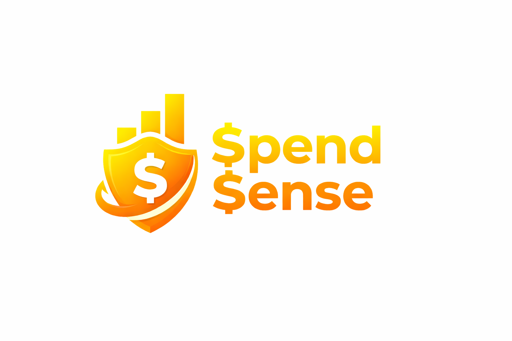
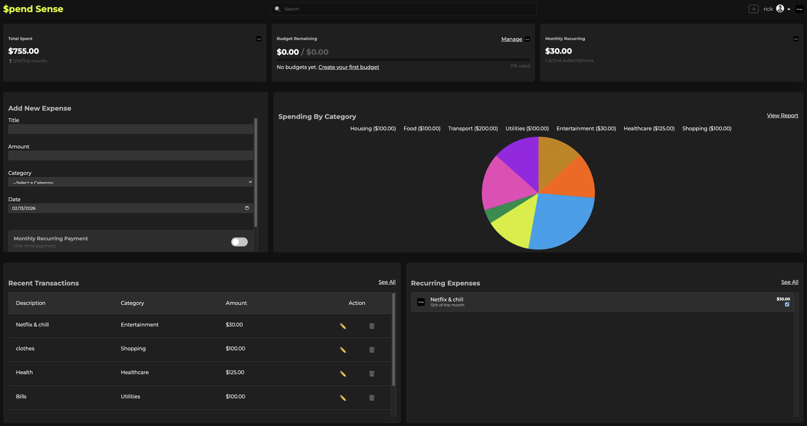

#  💰 $pendSense - Personal Expense Tracker

##  
[Launch App](https://spend-sense-puce-eta.vercel.app/)
**Track your spending, manage budgets, and take control of your finances**

---

## 📖 Overview

**$pendSense** is designed to help users manage their personal finances with little to zero effort. Track ur expenses, set budgets, manage recurring payments and being able to visualize your spending habits all in one intutitive dashboard.

![Home Page] 

---

### 📊 Why use $pendSense?
- 💸 **Expense Tracking** - Quickly log expenses with categories and Recent Transactions.
- 🔄 **Recurring Payments** - Take control of your subscriptions and recurring bills instantly with one simple toggle.
- 🥧 **Visual Analytics** - Understand spending patterns with interactive pie charts.
- 💵 **Budget Management** - Set monthly limits and track progress in real-time.
- 📱 **Responsive Design** - Works seamlessly on desktop and mobile devices.

---

### 📊 Dashboard Overview

The dashboard provides real-time budget monitoring with visual progress indicators, helping users stay aware of how much they’ve spent versus their set limits. Users can quickly review active subscriptions and recurring payments to better manage ongoing expenses. Additionally, the latest expense entries are displayed with convenient edit and delete options, making it simple to update or correct transactions as needed.

---

### ✨ Key Features

- ✅ Create, read, update, and delete expenses
- ✅ Categorize expenses (Housing, Food, Transport, Entertainment, etc.)
- ✅ Toggle for one-time vs recurring expenses
- ✅ Spending by category pie chart
- ✅ Detailed transaction history

---
## Getting Started

1. **Sign Up** - Create a new account with username and password
2. **Sign In** - Log in to access your dashboard
3. **Add Expenses** - Click "+ Add Expense" to log a new transaction Fill in the amount
4. Select a **category** (Food, Housing, Transport, etc.)
5. Set the **date**
6. Toggle **"Recurring"** if it's a recurring expenses 
7. Click **"Add Expense"**
8. **View Analytics** - Check spending patterns and budget progress!

---
 ## Technologies Used
 * React
 * CSS
 * JavaScript
 * node

 ---

